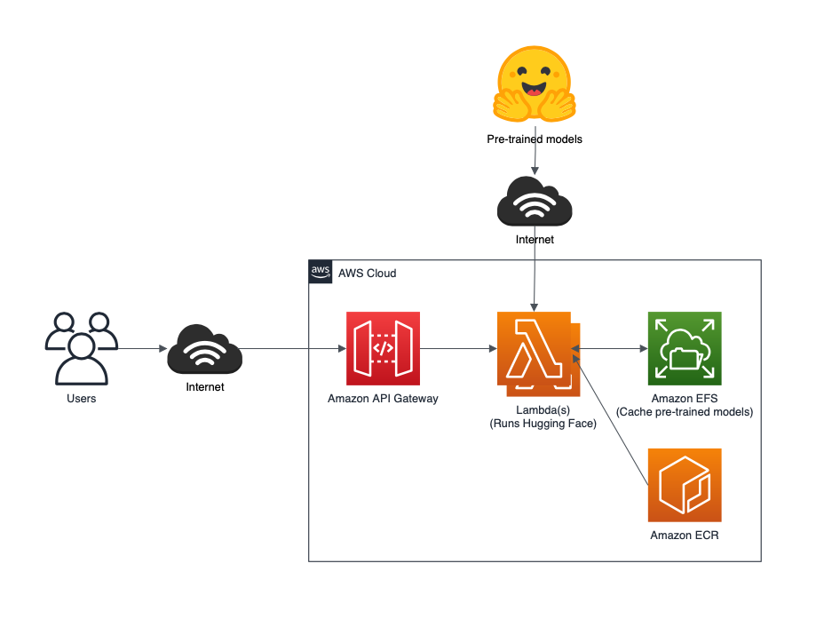

# Zero administration inference with AWS Lambda for :hugs:

### Note: This is not production code and simply meant as a demo

[Hugging Face](https://huggingface.co/) Transformers is a popular
open-source project that provides pre-trained, natural language
processing (NLP) models for a wide variety of use cases. Customers with
minimal machine learning experience can use pre-trained models to
enhance their applications quickly using NLP. This includes tasks such
as text classification, language translation, summarization, and
question answering - to name a few.

## Overview

Our solution consists of an [AWS Cloud Development
Kit](https://aws.amazon.com/cdk/) (AWS CDK) script that automatically
provisions container image-based Lambda functions that perform ML
inference using pre-trained Hugging Face models. This solution also
includes [Amazon Elastic File System](https://aws.amazon.com/efs/) (EFS)
storage that is attached to the Lambda functions to cache the
pre-trained models and reduce inference latency.


In this architectural diagram:
1.  Serverless inference is achieved by using Lambda functions that are
    based on container image
2.  The container image is stored in an [Amazon Elastic Container
    Registry](https://aws.amazon.com/ecr/) (ECR) repository within your
    account
3.  Pre-trained models are automatically downloaded from Hugging Face
    the first time the function is invoked
4.  Pre-trained models are cached within Amazon Elastic File System
    storage in order to improve inference latency

The solution includes Python scripts for two common NLP use cases:
-   Sentiment analysis: Identifying if a sentence indicates positive or negative sentiment. It uses a fine-tuned model on sst2, which is a [GLUE task](https://arxiv.org/abs/1804.07461).
-   Summarization: Summarizing a body of text into a shorter, representative text. It uses a [Bart](https://arxiv.org/abs/1910.13461) [model](https://huggingface.co/transformers/model_doc/bart.html) that was fine-tuned on the [CNN / Daily Mail dataset](https://github.com/abisee/cnn-dailymail).
For simplicity, both of these use cases are implemented using Hugging
Face
[pipelines](https://huggingface.co/transformers/main_classes/pipelines.html).

## Prerequisites
The following is required to run this example:
-   [git](https://git-scm.com/)
-   [AWS CDK v2](https://docs.aws.amazon.com/cdk/latest/guide/getting_started.html)
-   [Python](https://www.python.org/) 3.6+
-   [A virtual env](https://docs.python.org/3/library/venv.html#module-venv) (optional)

## Deploying the example application
1.  Clone the project to your development environment:
```bash
git clone <https://github.com/aws-samples/zero-administration-inference-with-aws-lambda-for-hugging-face.git>
```
2.  Install the required dependencies:
```bash
pip install -r requirements.txt
```
3.  Bootstrap the CDK. This command provisions the initial resources
    needed by the CDK to perform deployments:
```bash
cdk bootstrap
```
4.  This command deploys the CDK application to its environment. During
    the deployment, the toolkit outputs progress indications:
```bash
cdk deploy
```
## Understanding the code structure
The code is organized using the following structure:
```bash
├── inference
│   ├── Dockerfile
│   ├── sentiment.py
│   └── summarization.py
├── app.py
└── ...
```

The ```inference``` directory contains:
-   The ```Dockerfile``` used to build a custom image to be able to run PyTorch Hugging Face inference using Lambda functions
-   The Python scripts that perform the actual ML inference

The ```sentiment.py``` script shows how to use a Hugging Face Transformers
model:

```python
import json
from transformers import pipeline

nlp = pipeline("sentiment-analysis")

def handler(event, context):
response = {
    "statusCode": 200,
    "body": nlp(event['text'])[0]
}
return response
```
For each Python script in the inference directory, the CDK generates a
Lambda function backed by a container image and a Python inference
script.

## CDK script
The CDK script is named ```app.py``` in the solution's repository. The
beginning of the script creates a virtual private cloud (VPC).
```python
vpc = ec2.Vpc(self, 'Vpc', max_azs=2)
```
Next, it creates the EFS file system and an access point in EFS for the
cached model:
```python
fs = efs.FileSystem(self, 'FileSystem',
vpc=vpc,
removal_policy=RemovalPolicy.DESTROY)
access_point = fs.add_access_point('MLAccessPoint',
create_acl=efs.Acl(
owner_gid='1001', owner_uid='1001', permissions='750'),
path="/export/models",
posix_user=efs.PosixUser(gid="1001", uid="1001"))
```
It iterates through the Python files in the inference directory:
```python
docker_folder = os.path.dirname(os.path.realpath(__file__)) + "/inference"
pathlist = Path(docker_folder).rglob('*.py')
for path in pathlist:
```
And then creates the Lambda function that serves the inference requests:
```python
base = os.path.basename(path)
filename = os.path.splitext(base)[0]
# Lambda Function from docker image
function = lambda_.DockerImageFunction(
    self, filename,
    code=lambda_.DockerImageCode.from_image_asset(docker_folder,
    cmd=[filename+".handler"]),
    memory_size=8096,
    timeout=Duration.seconds(600),
    vpc=vpc,
    filesystem=lambda_.FileSystem.from_efs_access_point(
    access_point, '/mnt/hf_models_cache'),
    environment={
        "TRANSFORMERS_CACHE": "/mnt/hf_models_cache"},
    )
```

## Adding a translator 
Optionally, you can add more models by adding Python scripts in the
inference directory. For example, add the following code in a file
called ```translate-en2fr.py```:
```python
import json
from transformers
import pipeline

en_fr_translator = pipeline('translation_en_to_fr')

def handler(event, context):
    response = {
        "statusCode": 200,
        "body": en_fr_translator(event['text'])[0]
    }
    return response
```
Then run:
```bash
$ cdk synth
$ cdk deploy
```
This creates a new endpoint to perform English to French translation.

## Cleaning up
After you are finished experimenting with this project, run ```cdk destroy``` to remove all of the associated infrastructure.

## License
This library is licensed under the MIT No Attribution License. See the [LICENSE](LICENSE) file.
Disclaimer: Deploying the demo applications contained in this repository will potentially cause your AWS Account to be billed for services.

## Links
- [:hugs:](https://huggingface.co)
- [AWS Cloud Development Kit](https://aws.amazon.com/cdk/)
- [Amazon Elastic Container Registry](https://aws.amazon.com/ecr/)
- [AWS Lambda](https://aws.amazon.com/lambda/)
- [Amazon Elastic File System](https://aws.amazon.com/efs/)